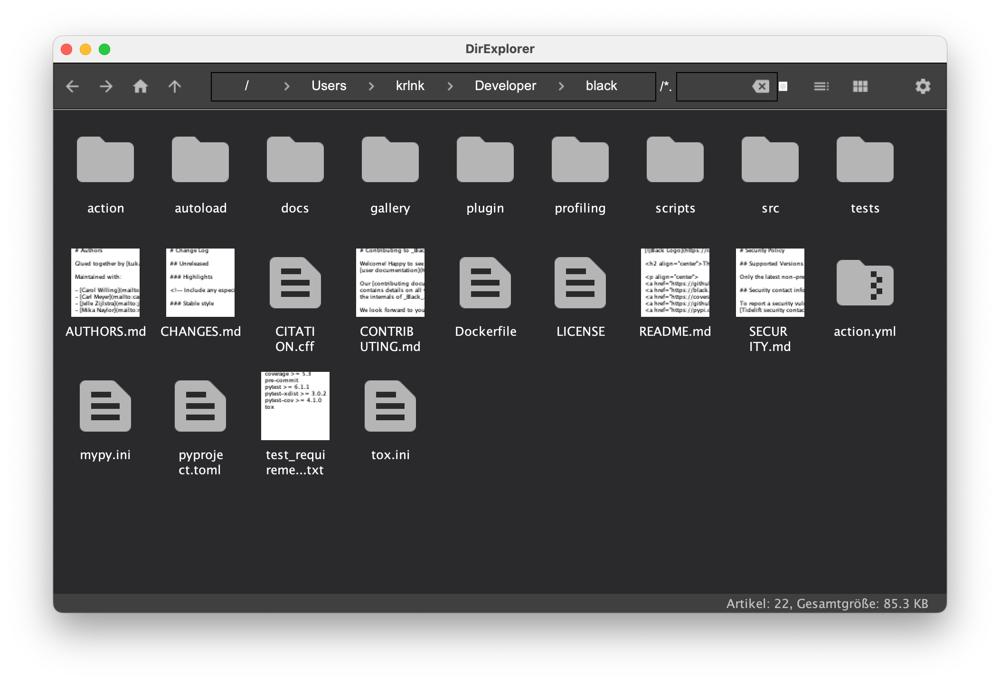

# DirExplorer

This is a test project for the Software Developer position.
The task is to create a Swing application with the following features:

* **Directory Browsing:** Browse the structure and contents of directories 
on your local disk and inside ZIP archives.
* **File Preview:** Preview files in the selected directory.
Currently, images, text and pdf files are supported.
* **File Filtering:** Filter files in the directory by a specified extension.

Implementation details:

* The user interface design is left to the candidate's discretion.
* The program is written in Java or Kotlin and is compatible with various operating systems.
* The task evaluates not only the quality of the code but also the
convenience and functionality of the UI.

## Screenshots

Here are some screenshots of the application:

* **Overall look:** The application provides a clean and intuitive interface for browsing directories.

* **Dark Theme:** Users can switch to a dark theme for a more comfortable viewing experience in low-light environments.

* **File Filtering:** Easily filter files by their extension to quickly find the files you need.

* **Table View:** Choose between a grid or table layout for viewing files and directories.

## Running the application

To run the application, open the project in IntelliJ IDEA and execute it.

## Implemented functions

You can either run the application (which opens in the home directory),
or open the desired directory from the command line.

### Navigation

#### Using navigation buttons

The application provides several navigation buttons for easy directory browsing.

* Back: Navigate to the previous directory.
* Forward: Navigate to the next directory.
* Home: Navigate to the home directory. The home directory is determined based on the operating system.
* Level Up: Navigate to the parent directory.

#### Using address bar

The address bar allows you to jump into any parent directory.
Use the field after "/*" to filter files by extension.

#### Right panel

The right panel provides options to switch between table and grid view, and access the settings menu.

### Settings

The settings menu allows you to customize the application.

Currently, you can adjust the following settings:

* **Color Themes:** Choose between two color themes - light and dark.
* **Language Selection:** The application supports multiple languages - English, German, and Russian.
* **Show Hidden Files:** This option allows you to decide whether you want to display hidden files in the directory. 

### View modes

The application offers different view modes to cater to your browsing preferences.

* **Table:** In this mode, files and directories are displayed in a tabular format.
This is useful if you want to view detailed information about the files, such as their size and modification date.
* **Icons:** In this mode, files and directories are displayed as icons.
This is useful if you prefer a more visual and compact representation of your files.

# This README will be updated as more features are added and changes are made to the application.
